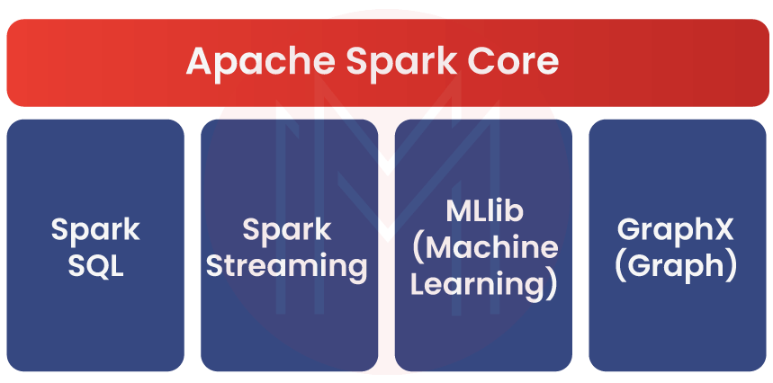
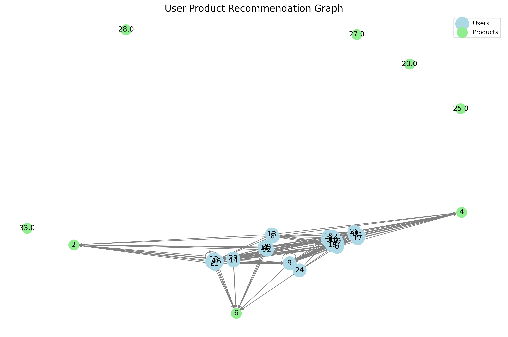
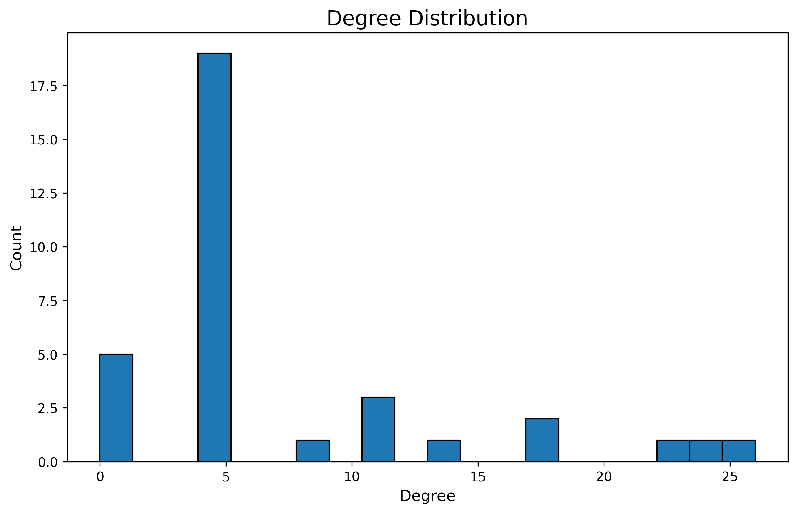
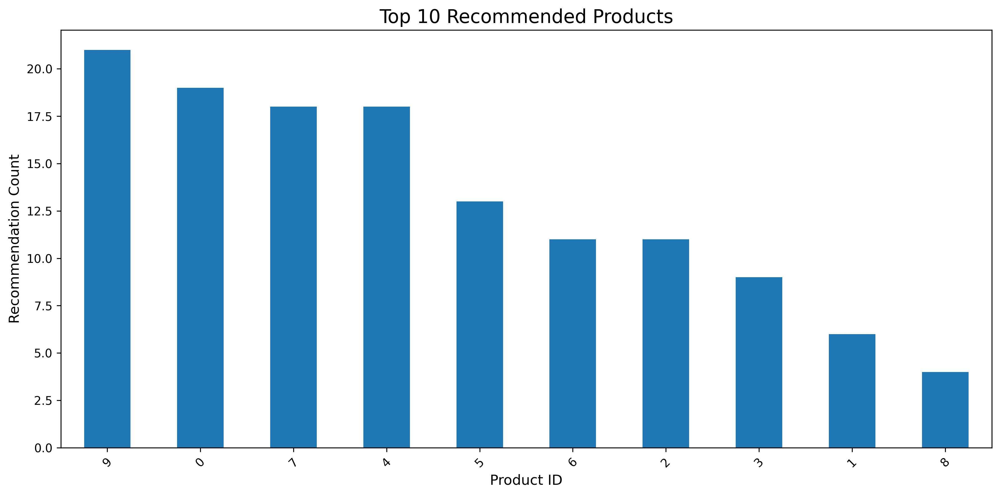

# Product recommendation system

This project is a real-time product recommendation system built using Apache Spark, Kafka, and Python. It processes streaming sales data, generates product recommendations, and provides visualizations for analysis.


## Overview

This project is a real-time product recommendation system that uses Apache Spark for stream processing and machine learning. It processes incoming sales data, builds a recommendation model, and generates product recommendations for users. The system also includes data visualization components to help interpret the results.

## Key Components and Capabilities

- Stream Processing
- Data Accumulation
- Machine Learning Model
- Model Evaluation
- Graph-based Representation
- Data Visualization
- Data Export
- Error Handling and Logging
- Scalability
- Flexibility
- Real-time Updates

## Potential Applications:

- E-commerce platforms for personalized product recommendations.
- Content streaming services for suggesting movies, music, or articles.
- Online advertising for targeted ad placements.
- Retail analytics for understanding customer preferences and product relationships.

## Stack

- Docker
- Python
- Spark (PySpark)
    - Streaming
    - SQL
    - MLlib
    - Graphx
- Kafka
- Zookeeper




## How It Works

### 1. Data Ingestion
- Sales data is streamed into the system via Kafka.
- Each record contains information about a user's purchase (user ID, product ID, quantity, timestamp).

### 2. Stream Processing
- Apache Spark's structured streaming is used to process the incoming data.
- Data is accumulated until a sufficient amount is collected (configurable threshold).

### 3. Data Preparation
- Once enough data is collected, it's prepared for model training:
  - User and product IDs are indexed.
  - Data is aggregated to create user-product interaction matrix.

### 4. Model Training
- An Alternating Least Squares (ALS) collaborative filtering model is trained using Spark MLlib.
- The data is split into training and test sets.

### 5. Recommendation Generation
- The trained model generates top N product recommendations for each user.

### 6. Evaluation
- The model's performance is evaluated using Root Mean Square Error (RMSE) on the test set.

### 7. Graph Construction
- A graph is constructed from the recommendations:
  - Nodes represent users and products.
  - Edges represent recommendations.

### 8. Data Export
- The graph data (vertices and edges) is exported as CSV files.

### 9. Visualization
Three main visualizations are generated:
- User-Product Recommendation Graph: Shows the network of users and recommended products.
- Degree Distribution Plot: Displays the distribution of connections in the network.
- Top Recommended Products Chart: Highlights the most frequently recommended products.


## Get started

1. Ensure Docker and Docker Compose are installed on your system.

2. Clone the repository and install packages

```bash
$ python3 -m venv .venv
$ source .venv/bin/activate
$ pip install -r requirements-dev.txt
```

3. Build and run the Docker containers:

```bash
$ docker compose up --build
```

4. The Spark application will start processing data, and the Kafka producer will start sending simulated sales data.

5. Check the `results` directory for CSV files 

6. visualization images:

```bash
$ python3 visualize_graph.py
```


## Visualization

3 visualizations that can provide valuable insights into the recommendation system.

Let's go through each visualization and how to interpret them:

### User-Product Recommendation Graph



This graph shows the relationships between users (lightblue nodes) and products (lightgreen nodes).

**Interpretation:**

- The size and density of connections can indicate how diverse or concentrated the recommendations are.
- Heavily connected products (nodes with many edges) are frequently recommended items.
- Isolated or less connected users might be new users or those with unique preferences.
- Clusters of users connected to similar products might represent user segments with similar tastes.


### Degree Distribution



This histogram shows the distribution of node degrees (number of connections) in the graph.

**Interpretation:**

- The shape of the distribution can tell you about the nature of the recommendation system:
    - A long-tailed distribution (many nodes with few connections, few nodes with many connections) is common in recommendation systems and indicates a presence of "popular" items.
    - Multiple peaks could indicate distinct user or product segments.
- The range of degrees shows how varied the connectivity is in the system.
- Very high degree nodes might be "blockbuster" products or very active users.


### Top 10 Recommended Products 



This bar chart shows the most frequently recommended products.

**Interpretation:**

- These are the "best-seller" or most popular items in terms of recommendations.
- A steep decline in the bar heights might indicate a "long tail" effect where a few products dominate recommendations.


## Future Improvements

- Implement real-time visualization updates.
- Add more advanced recommendation algorithms.
- Integrate with a front-end for interactive user recommendations.
- Incorporate additional data sources for more nuanced recommendations.